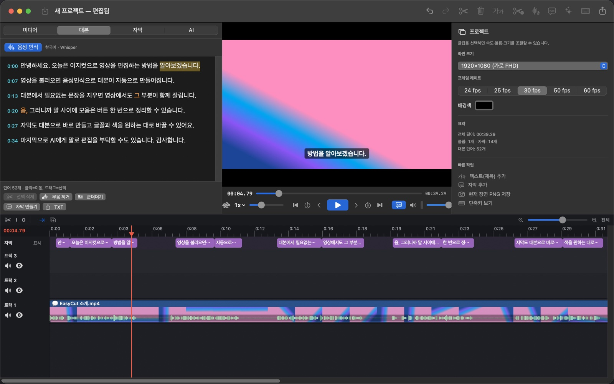
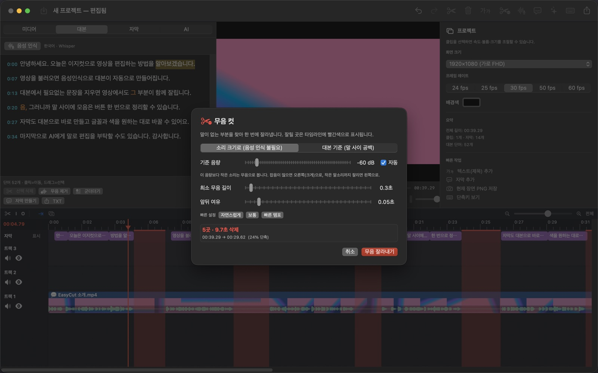
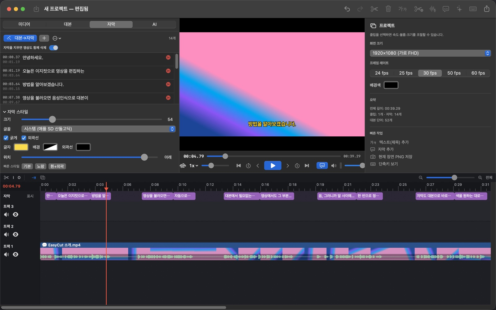
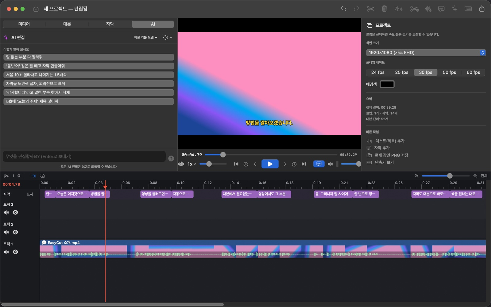

# EasyCut — 쉬운 Mac 영상 편집기

**한국어** | [English](README.en.md)

쉬운 컷 편집 + 음성 인식(STT) 대본 편집 + 자막 + AI 편집을 한 앱에 담은 macOS 설치형 영상 편집기입니다.

**[⬇︎ 최신 버전 다운로드 (Releases)](https://github.com/contenjoo/easycut/releases/latest)**

윈도우 버전(베타): [EasyCut for Windows 내려받기](https://github.com/contenjoo/easycut/releases?q=win-v&expanded=true) · 소스는 [`windows/`](windows)



| 원클릭 무음 컷 | 자막 스타일 | AI 편집 |
|---|---|---|
|  |  |  |

## 설치

**M1 이상 Apple Silicon Mac, macOS 14 이상** 전용입니다.

1. [Releases](https://github.com/contenjoo/easycut/releases/latest)에서 `EasyCut-x.y.z.dmg`를 받아 열고 EasyCut을 응용 프로그램 폴더로 끌어 놓습니다.
2. 처음 열 때 한 번: 서명·공증되지 않은 앱이라 경고가 뜨면 시스템 설정 › 개인정보 보호 및 보안 › **[그래도 열기]**
3. Whisper 모델(574MB)은 대본 탭의 **[Whisper 켜기]**, 유튜브 도구(yt-dlp)는 링크 창의 **[유튜브 도구 설치]** 한 번으로 받습니다.

Whisper 음성 인식 엔진과 ffmpeg(MKV 등 변환)가 앱 안에 들어 있어 Homebrew 같은 추가 설치가 필요 없습니다.
AI 편집은 선택 기능입니다. Claude Pro/Max 플랜 로그인(Claude Code) 또는 본인 API 키로 쓰며, API 키는 macOS 키체인에만 저장됩니다.

## 소스에서 빌드

필요: Xcode Command Line Tools(Swift 5.10+), `cmake`(`brew install cmake`), `git`

```bash
./scripts/build_deps.sh      # Whisper·ffmpeg를 소스에서 빌드해 vendor/bin 에 (처음 한 번, 10분 내외)
./scripts/build_app.sh --dmg # 앱 번들 + DMG (dist/)
```

## 주요 기능

| 기능 | 설명 |
|---|---|
| 화면·얼굴 녹화 | 전체 화면·창·영역을 골라 카메라(얼굴)·마이크·컴퓨터 소리와 함께 녹화 → 끝나면 화면은 트랙 1, 얼굴은 트랙 2 오른쪽 아래 작은 화면, 컴퓨터 소리는 트랙 3에 자동 배치하고 바로 음성 인식. 일시정지 ⌥⌘P, 정지 ⌥⌘. (다른 앱을 쓰는 중에도 동작). 녹화 창 ⌥⌘R, 파일은 동영상 › EasyCut 녹화 |
| 가져오기 | 영상(MP4·MOV·M4V, **MKV·WebM·AVI·FLV·WMV·TS·MTS·MPG** 등), 오디오(MP3·WAV·M4A·AAC·AIFF), 사진(PNG·JPG·HEIC·GIF·TIFF). 끌어다 놓기 지원 |
| 멀티 트랙 타임라인 | 클립 이동·트림·분할·복제·복사/붙여넣기, 트랙 음소거/숨김, 스냅, 썸네일·파형 표시, 트랙 높이 조절, 타임라인 영역 크기 조절(위 경계선 끌기) |
| 최대 20배속 | 미리보기 재생 0.25~20배속, 클립 속도 0.1~20배(음정 유지) |
| 음량 미터 | 재생바에 실제 재생 중인 소리 크기 표시 (막대가 움직이는데 안 들리면 Mac 출력 장치 문제) |
| 음성 인식(STT) | Apple 온디바이스(설치 불필요, 인터넷 불필요) 또는 Whisper(선택, 고정확도) |
| 대본으로 편집 | 대본에서 단어를 선택해 ⌫ → 그 말이 영상에서 잘림. 단어 클릭 = 그 위치로 이동, 단어 고치기(↩) |
| 원클릭 무음 컷 | 음성 인식 없이 소리 크기만으로 무음 검출 → 타임라인에 빨간색 미리보기 → 한 번에 삭제 |
| 군더더기 제거 | '음', '어' 같은 말을 대본에서 찾아 한 번에 삭제 |
| 자막 | 대본으로 자동 생성, 직접 추가/수정, 타임라인에서 끌어 조정, 스타일(글꼴·색·배경·외곽선·위치), SRT 가져오기/내보내기, 영상에 입히기 |
| 텍스트(제목) | 화면 위 텍스트 클립, 위치·크기·색 조절 |
| 화면 배치 | 크기·위치·불투명도, PIP(화면 속 화면), 페이드 인/아웃, 모양(원·둥근 사각형), 인물 배경 흐리게·지우기, 녹화 때 마우스 클릭 강조 |
| 자막으로 컷 편집 | 자막 한 줄을 지우면 그 구간 영상도 삭제, 자막 목록에서 끌어 순서를 바꾸면 영상도 함께 이동, 트랙 1 클립은 끌어서 끼워 넣기(⌥+끌기 = 자유 이동) |
| AI 편집 | "무음 다 잘라줘", "3분~5분 2배속" 처럼 말로 편집 (Claude Pro/Max 플랜 로그인 또는 API 키). 모델(Fable 5.1·Opus 5.5·Opus 5·Sonnet 5·Haiku 4.5)·추론 강도·생각 과정 보기 선택 |
| Claude 연결(MCP) | Claude Code / Claude 데스크톱에서 앱을 직접 조작 |
| 내보내기 | MP4(H.264/HEVC), MOV(ProRes), 오디오(M4A), 4K/1080p/720p/480p, SRT 동시 저장, 장면 PNG 저장 |
| 프로젝트 | `.easycut` 파일 저장/열기, 무제한에 가까운 실행 취소(300단계), **실시간 자동 저장**(저장 전 새 프로젝트는 복구용으로 보관 → 다음 실행 때 복구) |
| 영어 지원 | macOS 언어가 한국어가 아니면 영어로 표시. EasyCut › 언어 / Language에서 바꿀 수 있음(다시 시작하면 적용) |
| 자동 업데이트 | 켤 때 GitHub에 새 버전이 있으면 알려 주고, [업데이트]를 누르면 받아서 바꾼 뒤 다시 실행 (EasyCut › 업데이트 확인…) |

## 단축키 (앱에서 ⌘/ 로도 볼 수 있음)

| 키 | 동작 |
|---|---|
| Space | 재생 / 일시정지 |
| L / J / K | 빠르게(1→2→4→8→16→20배) / 느리게 / 정지 |
| ] / [ / \ | 속도 한 단계 올리기 / 내리기 / 1배속 |
| ⌥1…⌥9, ⌥0 | 1·2·3·4·5·8·10·12·16·20배속 바로 선택 |
| , / . | 이전 / 다음 프레임 |
| ← / → , ⇧← / ⇧→ | 1초 / 5초 이동 |
| ↑ / ↓ | 이전 / 다음 편집점 |
| S 또는 ⌘T | 재생헤드에서 분할 (⇧⌘T 모든 트랙) |
| I / O / X | 구간 시작 / 끝 / 해제 → ⌫ 로 구간 잘라내기 |
| ⌫ / ⌘⌫ | 삭제 / 삭제 후 빈틈 메우기 |
| ⌘C ⌘X ⌘V ⌘D | 클립 복사·잘라내기·붙여넣기·복제 |
| ⌘Z / ⇧⌘Z | 실행 취소 / 다시 실행 |
| ⇧⌘R | 음성 인식 |
| ⇧⌘X | 원클릭 무음 컷 |
| ⇧⌘C | 대본으로 자막 만들기 |
| C / T | 자막 추가 / 텍스트 추가 |
| ⌘= / ⌘- / ⇧Z | 타임라인 확대 / 축소 / 전체 보기 (⌘+스크롤, 돋보기 버튼) |
| 빈 곳 끌기 / 눈금자 끌기 | 클립 여러 개 선택 / 시간 구간 선택 → ⌫ 로 잘라내기 |
| ⌘G / ⇧⌘G / ⌘J | 그룹으로 묶기 / 그룹 해제 / 하나로 합치기(잘린 조각은 한 클립으로, 나머지는 붙여서 그룹) |
| ⌘1~⌘4 | 미디어 / 대본 / 자막 / AI 탭 |
| ⌘I / ⌘E / ⌘S / ⌘O | 가져오기 / 내보내기 / 저장 / 열기 |

한글 입력 상태에서도 단축키가 동작합니다(키 위치 기준).

## 링크로 가져오기 (유튜브 등)

미디어 탭 **[링크]** 또는 파일 › 링크로 가져오기(⇧⌘I). 주소를 붙여 넣으면 편집하기 좋은 H.264 MP4로 받아 바로 타임라인에 올립니다 (처음 한 번 링크 창의 [유튜브 도구 설치], 막히면 [유튜브 도구 업데이트]).

- 화질 720p/1080p/최고/소리만, **일부 구간만 받기**(예: 1:30~5:00), 업로더가 올린 한국어·영어 자막 함께 받기
- 받은 파일은 `~/Movies/EasyCut 다운로드`에 저장
- AI 탭에서도 "이 링크 가져와서 무음 잘라줘"처럼 요청 가능
- 본인 영상이나 저작권자에게 이용 허락을 받은 영상만 내려받아 편집하세요.

## MKV 등 기타 영상

MKV·WebM·AVI 같은 파일은 가져올 때 자동으로 MP4로 바꿔서 씁니다 (ffmpeg는 앱에 내장).

- H.264/HEVC 영상은 다시 압축하지 않고 포장만 바꿔 몇 초 안에 끝나며 화질 손실이 없습니다.
- VP9·AV1 등은 Mac 하드웨어 인코더로 H.264로 변환합니다.
- MKV 안에 자막(SRT/ASS)이 있으면 빈 프로젝트에 가져올 때 자막 트랙으로 함께 들어옵니다.
- 변환본은 `~/Library/Application Support/EasyCut/converted`에 보관되어 같은 파일은 다시 변환하지 않고, 지워져도 프로젝트를 열 때 원본에서 다시 만듭니다.

## 음성 인식 엔진

- **Apple 내장(기본)**: 추가 설치 없이 이 Mac 안에서 처리. 긴 영상은 무음 지점에서 25~45초 단위로 나눠 인식합니다.
- **Whisper(설치되어 있으면 기본)**: 한국어 정확도가 더 높고 훨씬 빠릅니다 (2시간 녹화 약 5분, Apple 엔진은 수십 분). 긴 녹화에서 같은 문장이 반복되는 현상을 막는 설정이 적용되어 있습니다.
- 두 엔진 모두 인식되는 대로 대본이 바로바로 나타납니다.
  - 대본 탭의 **[Whisper 켜기]** 또는 엔진 설정 › Whisper › 모델 **내려받기** (Large v3 Turbo 권장, 약 574MB)

## AI 편집 / Claude 연결

- **Claude 연결 도우미** (AI 탭 또는 도구 › Claude 연결…): Claude Code 설치 → 로그인 → Claude 데스크톱/Claude Code 연결을 버튼으로 진행
- **앱 안에서 — Claude 플랜(기본, API 키 불필요)**: Claude Code를 설치하고 터미널에서 `claude` → `/login`으로 Pro/Max 계정에 한 번 로그인해 두면, 왼쪽 **AI** 탭에서 "말 없는 부분 다 잘라줘"처럼 입력하는 것만으로 구독 플랜 사용량으로 편집합니다. (앱이 내부적으로 로그인된 Claude Code를 실행해 편집 도구만 쓰게 합니다.)
- **앱 안에서 — API 키**: AI 탭 ⚙︎ › 연결 방식 › API 키 → 키 입력(키체인 저장). 모델은 `claude-opus-5`.
- **Claude Code에서**: 앱을 켠 상태로 한 번만 등록

  ```bash
  claude mcp add easycut -- /Applications/EasyCut.app/Contents/MacOS/EasyCut --mcp
  ```

- **Claude 데스크톱에서**: 설정 › 개발자 › 구성 편집의 `mcpServers`에 추가

  ```json
  "easycut": { "command": "/Applications/EasyCut.app/Contents/MacOS/EasyCut", "args": ["--mcp"] }
  ```

연결은 이 Mac 안(127.0.0.1)에서만 이뤄지며, 앱 지원 폴더의 비밀 토큰을 가진 요청만 받습니다. AI가 한 편집은 모두 ⌘Z로 되돌릴 수 있습니다.

## 개발

```bash
swift build                                  # 디버그 빌드
.build/debug/EasyCut --selftest /tmp/ectest  # 편집 엔진 자체 검사 (테스트 미디어 생성 → 편집 → 내보내기 검증)
./scripts/build_app.sh --dmg                 # 앱 번들 + DMG
```

구조:

- `Sources/EasyCut/Model` — 프로젝트/클립/자막 데이터와 편집 연산(분할·리플 삭제·속도·대본 컷)
- `Sources/EasyCut/Engine` — AVFoundation 합성(커스텀 컴포지터), 내보내기, 음성 인식, 무음 검출
- `Sources/EasyCut/App` — 편집 상태, 재생 제어(20배속), 단축키, 자체 검사
- `Sources/EasyCut/Views` — 타임라인(AppKit), 대본 편집기, 패널, 시트
- `Sources/EasyCut/AI` — 편집 도구 정의, Claude API 대화, MCP 제어 서버

## 라이선스

[MIT](LICENSE). 배포판에 포함된 FFmpeg(LGPL-2.1)와 whisper.cpp(MIT)의 라이선스는 [`vendor/licenses/`](vendor/licenses)에 있습니다.
